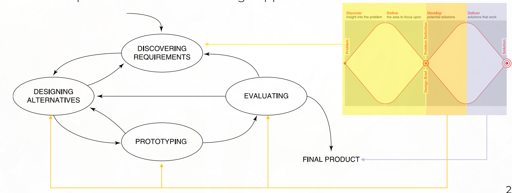
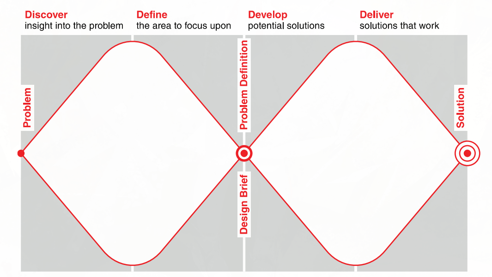
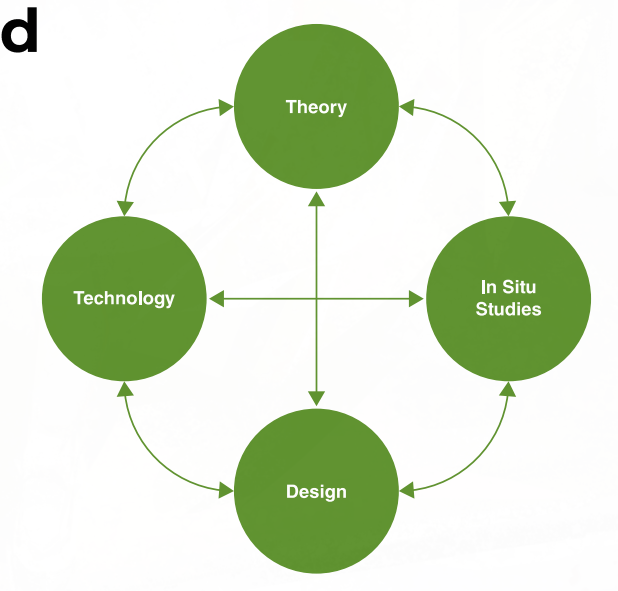

#+TITLE: CPT208 Week 02 - Discovering Requirements
#+AUTHOR: InubashiriLix 
#+LANGUAGE: en
#+OPTIONS: toc:2 num:t

* How to Read This Lecture
这节课表面标题是 *Discovering Requirements*，但实际上混了三块内容：

1. *Interaction Design* 基础概念
2. *The Process of Interaction Design* 设计流程
3. *Discovering Requirements* 需求发现方法

复习时不要按 PPT 页码背，而是按下面这条线：

#+begin_quote
Interaction Design 是什么
→ 为什么要 involve users
→ Usability / User Experience goals 是什么
→ Interaction Design process 怎么走
→ Requirements 是什么
→ Requirements 怎么收集和表达
#+end_quote

* Interaction Design

** Definition
*Interaction Design* is the design of interactive products that support the way people communicate and interact in their everyday and working lives.
关键词：
- *interactive products*
- *communication*
- *interaction*
- *everyday lives*
- *working lives*

另一种定义：
#+begin_quote
Interaction Design is the design of spaces for human communication and interaction.
#+end_quote
简单理解：
#+begin_quote
Interaction Design 不只是画 UI，而是设计“人如何与系统互动”。
#+end_quote

** Interaction Design as an Umbrella Term
*Interaction Design* is an umbrella term covering many fields concerned with researching and designing computer-based systems for people.

It includes or relates to:

- *User Interface Design* (UI)
- *Software Design*
- *User-Centered Design*
- *Product Design*
- *Web Design*
- *User Experience Design* (UX)
- *Interactive System Design*

** What is involved in Interaction Design?
The two most important elements are:

- *Users*
- *Goals*

Interaction design focuses on:

- who the users are
- what goals users want to achieve
- what activities users perform
- what context the product will be used in
- how the product supports users' communication and interaction

* Core Characteristics of Interaction Design

** Three Core Characteristics
There are three core characteristics of interaction design:

1. *Users should be involved* throughout the development of the project.
2. Specific *usability goals* and *user experience goals* should be identified, clearly documented, and agreed at the beginning of the project.
3. *Iteration* is needed throughout the core activities.

记忆版：
#+begin_quote
involving user throughout, specifying usability and UX goals early, Interation throughout the core activities
#+end_quote

** Importance of Involving Users
Users should be involved because they help the design team understand real needs and avoid wrong assumptions.

*** 1. Understanding Users' Goals
User involvement helps designers understand what users actually want to achieve.
Benefits:
- better understanding of real user needs
- fewer wrong assumptions
- better product decisions

*** 2. Expectation Management
User involvement helps manage expectations.
Benefits:
- realistic expectations
- no surprises or disappointments
- timely training
- better communication
- no hype

*** 3. Ownership
User involvement can create a sense of ownership.
Benefits:
- users become active stakeholders
- users are more likely to forgive or accept problems
- users are more likely to accept the final product
- acceptance can make a big difference to product success

** Degrees of User Involvement
Users can be involved in different degrees.

*** 1. Users as Members of the Design Team
Users can become part of the design team.

**** Full-time
Advantages: constant input from users
Disadvantages: users may lose touch with ordinary users

**** Part-time
Advantages: users can provide occasional input
Disadvantages:
- input may be patchy
- participation may be stressful

**** Participatory Design
All stakeholders are involved in the early stages of design.
重点：
#+begin_quote
Participatory design means involving users and stakeholders directly in the design process, especially in the early stages.
#+end_quote

*** 2. Face-to-Face Activities
Examples:
- individual interviews
- group interviews
- workshops
- user testing sessions

*** 3. Online Contributions
Examples:
- online feedback systems
- crowdsourcing design ideas
- citizen science

*** 4. User Involvement After Product Release
Example:
- customer review analysis

* Usability and User Experience
** Overview
There is no clear cut between *usability* and *user experience*, but they focus on different aspects.
#+begin_quote
Usability asks whether the system works well.
User Experience asks how the user feels when using it.
#+end_quote

** Usability
*Usability* is more objective.
It asks:
- Is the system useful?
- Can users complete tasks effectively?
- Can users complete tasks efficiently?
- Is the system safe?
- Is it easy to learn?
- Is it easy to remember?

*** Example Usability Goals
1. *Effectiveness*
   - How good is the system at supporting task completion?
2. *Efficiency*
   - How fast or easy is it to complete the task?
3. *Safety*
   - Can users avoid serious errors?
4. *Utility*
   - Does the system provide the functions users need?
5. *Learnability*
   - Is the system easy to learn?
6. *Memorability*
   - Is it easy to remember how to use the system after some time?

** User Experience
*User Experience* is more subjective.
It asks:
- How do users feel when using the product?
- Is the product enjoyable?
- Is it satisfying?
- Is it frustrating?

*** Desirable UX Goals
Examples:
satisfying enjoyable engaging pleasurable exciting entertaining helpful motivating fun rewarding emotionally fulfilling

*** Undesirable UX Aspects
Examples:
- boring frustrating annoying unpleasant patronizing making users feel stupid gimmicky

** Difference Between Usability and User Experience
*Usability* focuses on objective performance.
*User Experience* focuses on subjective feelings.
Example: campus app
| Aspect | Example Question |
|--------+------------------|
| Usability | Can students find their timetable quickly? |
| User Experience | Do students feel the app is pleasant and not frustrating? |

** Trade-off Between Usability and UX
Sometimes usability and user experience conflict.
Examples:
- A system can be efficient but boring.
- A system can be fun but inefficient.
- A system can be visually attractive but hard to use.

Designers need to balance both.

** Historical Development
Historically, HCI focused mainly on *usability*.
Now, HCI also focuses on a wider range of *user experience* aspects, including emotions, enjoyment, engagement, and social experience.

* The Process of Interaction Design
** Four Basic Activities
Interaction Design has four basic activities:
1. *Discovering requirements*
2. *Designing alternatives*
3. *Prototyping*
4. *Evaluating*
*** 1. Discovering Requirements
Goal:
- understand users
- understand users' needs
- understand the problem space
- identify what the product should do
*** 2. Designing Alternatives
Goal:
- generate different possible design solutions
- avoid jumping to a single solution too early
- compare multiple design ideas
*** 3. Prototyping
Goal:
- create representations of design alternatives
- communicate design ideas
- allow designs to be assessed and tested
*** 4. Evaluating
Goal:
- evaluate the product
- evaluate the user experience
- find problems
- improve the design

** Important: The Process is Iterative
Interaction design is not linear.

Evaluation can lead designers back to:

- requirements
- design alternatives
- prototypes

Exam sentence:

#+begin_quote
The interaction design process is iterative. Designers discover requirements, design alternatives, prototype them, and evaluate the results. Evaluation findings may lead back to earlier activities for refinement.
#+end_quote

** Interaction Design Lifecycle Model

Better understanding:

#+begin_quote
The model is not a strict waterfall. The activities influence each other, and evaluation can happen throughout the process.
#+end_quote

** Double Diamond of Design

The *Double Diamond* model has four stages:
1. *Discover*
2. *Define*
3. *Develop*
4. *Deliver*

*** First Diamond: Problem
The first diamond focuses on understanding and defining the problem.
- Discover:
  - explore the problem space
  - understand users
  - understand context
- Define:
  - narrow down the problem
  - decide the key problem to solve

*** Second Diamond: Solution
The second diamond focuses on developing and delivering the solution.
- Develop:
  - generate possible solutions
  - create design alternatives
- Deliver:
  - select and refine the best solution
  - deliver a working solution
Exam sentence:
#+begin_quote
The Double Diamond model helps designers avoid jumping to solutions too early. It encourages designers to first explore and define the problem, then explore and deliver solutions.
#+end_quote

** Understanding the Problem Space
*** Explore
Questions to ask:
- What is the current user experience?
- Why is a change needed?
- How will this change improve the situation?

*** Articulate the Problem Space
To articulate the problem space means to explain the problem clearly.
Important points:
- It should be a team effort.
- Designers should explore different perspectives.
- Designers should avoid incorrect assumptions and unsupported claims.

** Other Process Models
*** Google Design Sprint
Google Design Sprint is a fast iterative process.

Stages:
1. Unpack
2. Sketch
3. Decide
4. Prototype
5. Test
Key idea:
#+begin_quote
Move quickly from understanding the problem to testing a prototype.
#+end_quote

*** Research in the Wild

Research in the Wild studies interaction in real-world contexts.
It connects:
- theory
- technology
- design
- in-situ studies

重点：
#+begin_quote
Research in the Wild does not only test technology in labs. It studies technology and interaction in real-world settings.
#+end_quote

* Practical Issues in Interaction Design

** Main Practical Questions
Practical issues are questions designers must answer during a real project.

Key questions:
1. Who are the users?
2. What are the users' needs?
3. How can alternative designs be generated?
4. How should designers choose among alternatives?
5. How can interaction design activities be integrated with other lifecycle models?

** User-Centered Approach
A user-centered approach has three main principles:
1. *Early focus on users and tasks*
2. *Empirical measurement*
3. *Iterative design*

*** 1. Early Focus on Users and Tasks
Designers should study users directly.

Focus on:
- users' tasks
- users' goals
- users' behaviour
- users' context of use
- users' characteristics
- users' activities
- users' environment

*** 2. Empirical Measurement
Designers should observe, record, and analyse users' reactions and performance.
This means design decisions should be based on evidence rather than guesses.

*** 3. Iterative Design
When problems are found in user testing, designers should:
1. fix the problems
2. improve the design
3. test again

** Early Focus on Users and Tasks
Users' tasks and goals are the driving force behind development.

Important points:
- Users' behaviour and context of use should be studied.
- Users' characteristics should be captured.
- Users should be consulted throughout development.
- Design decisions should be made in the context of users, their activities, and their environment.

Exam sentence:
#+begin_quote
A user-centered approach means that design decisions are based on real users, their tasks, goals, behaviours, and contexts of use.
#+end_quote

** Who Are the Users and Stakeholders?
*** Users
Users are the people who directly use the product.
However, users are not always obvious.
For some products, "user" may mean a very broad group of people.
For targeted products, users are associated with specific roles.

*** Stakeholders
Stakeholders are individuals or groups who can influence or be influenced by the success or failure of a project.

Stakeholders may include:
- direct users
- indirect users
- clients
- managers
- developers
- support staff
- organizations
- regulators

Important:
#+begin_quote
Stakeholders are broader than direct users.
#+end_quote

Why identify stakeholders?
- to know who should be included in design activities
- to understand different perspectives
- to avoid missing important needs or constraints

** What Are the Users' Needs?
Users rarely know what is possible.
Therefore, designers should not simply ask users what they want.
Instead, designers should:

- explore the problem space
- investigate who the users are
- investigate user activities
- try out ideas with potential users
- focus on users' goals
- focus on usability goals
- focus on user experience goals

Exam sentence:
#+begin_quote
Users may not be able to articulate exact requirements. Designers discover requirements by studying users' goals, activities, behaviours, and contexts.
#+end_quote

* Discovering Requirements
** What, How, and Why?
*** Purpose of Requirements Activity
The purpose of requirements activity is to:
1. explore the *problem space*
2. gain insights
3. establish a description of *what will be developed*

*** How to Capture Requirements
Requirements can be captured through:
- prototypes
- operational products
- structured or rigorous notations
- written records
- user stories
- requirement shells

Important:
#+begin_quote
Requirements should be recorded because different stakeholders may understand the same product differently.
#+end_quote

** Why Bother?
Requirements activity is important because miscommunication often happens at this stage.
If requirements are unclear, different people may imagine different products.
Classic example:
#+begin_quote
What the customer wanted, what the analyst designed, what the programmer built, and what was finally delivered may all be different.
#+end_quote

** What Are Requirements?
A *requirement* is a statement about an intended product that specifies what it is expected to do or how it will perform.

Simplified definition:
#+begin_quote
Requirement = what the product should do or how it should perform.
#+end_quote
Requirements can have different forms and different levels of abstraction.

Examples:
- atomic requirement shell
- user story

** Atomic Requirement Shell
An *atomic requirement shell* is a structured way to record a single requirement.

It may include:
- requirement number
- requirement type
- event or use case
- description
- rationale
- fit criterion
- customer satisfaction
- customer dissatisfaction
- dependencies
- conflicts
- supporting materials
- history

*** Why Use Atomic Requirement Shells?
Benefits:

- records requirements clearly
- makes requirements easier to check
- shows rationale behind requirements
- includes criteria for deciding whether the requirement is satisfied

** User Stories
A *user story* describes a requirement from the user's perspective.

Format:

#+begin_example
As a <role>, I want <behaviour>, so that <benefit>.
#+end_example

Example:

#+begin_example
As a student, I want to check my timetable quickly, so that I can know where my next class is.
#+end_example

Why useful?

- simple
- user-centered
- common in agile development
- focuses on role, behaviour, and benefit

* Kinds of Requirements

** Functional Requirements
*Functional requirements* describe what the system should do.

Examples:

#+begin_example
The system shall allow users to log in.
The app shall allow students to check their timetable.
The system shall allow users to search for nearby restaurants.
#+end_example

Key question:

#+begin_quote
What should the system do?
#+end_quote

** Non-functional Requirements
*Non-functional requirements* describe characteristics, constraints, or qualities of the product.

Examples:

#+begin_example
The system shall respond within 2 seconds.
The app shall be usable by first-year students.
The system shall run on both iOS and Android.
#+end_example

Key question:

#+begin_quote
How should the system perform?
#+end_quote

** Functional vs Non-functional Requirements
| Type | Focus | Example |
|------+-------+---------|
| Functional requirement | What the system should do | The app shall allow users to upload photos. |
| Non-functional requirement | How the system should perform | The app shall upload photos within 3 seconds. |

** Six Most Common Types of Requirements
The lecture highlights six common types:

1. *Functional requirements*
2. *Data requirements*
3. *Environment requirements*
4. *User characteristics*
5. *Usability goals*
6. *User experience goals*

*** 1. Functional Requirements
Question:

#+begin_quote
What should the system do?
#+end_quote

*** 2. Data Requirements
Questions:

- What kinds of data need to be stored?
- How will the data be stored?

Example:

#+begin_quote
The system needs to store user profiles, login records, and uploaded files in a database.
#+end_quote

*** 3. Environment Requirements
Environment requirements describe the context of use.

Types:

- physical environment
- social environment
- organizational environment
- technical environment

Examples:

- Is the environment noisy?
- Is the lighting poor?
- Will users collaborate?
- What devices will the system run on?
- What infrastructure is available?

*** 4. User Characteristics
User characteristics describe the target users.

Examples:

- nationality
- educational background
- attitude to computers
- novice or expert
- casual or frequent users
- user profile

Design implication:

- novice users may need prompts and clear instructions
- expert users may need shortcuts and flexibility
- frequent users may need efficient interactions
- casual users may need clear menu paths

*** 5. Usability Goals
Examples:

- effectiveness
- efficiency
- safety
- utility
- learnability
- memorability

*** 6. User Experience Goals
Examples:

- satisfying
- enjoyable
- engaging
- motivating
- fun
- rewarding

* Data Gathering for Requirements

** Main Data Gathering Techniques
Requirements can be gathered through:

- interviews
- observations
- questionnaires
- studying documentation
- researching similar products

** Interviews
Interviews ask users or stakeholders questions directly.

Good for:

- understanding opinions
- understanding motivations
- discovering user needs
- exploring detailed experiences

Weakness:

- time-consuming
- small sample size
- users may forget or misreport behaviour

** Observations
Observation means watching users perform tasks.

Good for:

- understanding real behaviour
- discovering problems users may not mention
- understanding context of use

Weakness:

- time-consuming
- users may behave differently when observed

** Questionnaires
Questionnaires collect answers from many users.

Good for:

- collecting data from many participants
- quantitative data
- comparing responses

Weakness:

- less detailed than interviews
- questions must be carefully designed
- response quality may vary

** Studying Documentation
Documentation includes:

- manuals
- procedures
- rules
- regulations
- existing workflow documents

Good for:

- understanding current procedures
- understanding regulations
- gaining background information
- not requiring stakeholder time

** Researching Similar Products
Researching similar products means studying existing or competing products.

Good for:

- prompting requirements
- finding common features
- finding design inspiration
- identifying weaknesses in existing products

** Combining Data Gathering Methods
Different methods reveal different information, so designers often combine them.

Possible methods:

- observation
- interviews
- diaries
- surveys
- think-aloud evaluation
- working prototype evaluation
- studying documentation
- evaluating other systems
- ethnographic study
- usability tests

* Contextual Inquiry

** Definition
*Contextual Inquiry* is a one-on-one field interview used to gather requirements in the user's real context.

It is part of *Contextual Design*, but can also be used on its own.

Features:

- one-on-one field interview
- often 1.5 to 2 hours long
- focuses on daily life or work relevant to the project
- uses a master-apprentice model

** Master-Apprentice Model
In contextual inquiry:

- the user is the master
- the researcher is the apprentice

Meaning:

#+begin_quote
The researcher learns from the user by observing and asking questions while the user performs real activities.
#+end_quote

** Four Main Principles
Contextual inquiry has four main principles:

1. *Context*
2. *Partnership*
3. *Interpretation*
4. *Focus*

*** 1. Context
Go to the user wherever they are and observe what they do as they do it.

*** 2. Partnership
User and interviewer explore the user's life or work together.

*** 3. Interpretation
Observations are interpreted by the user and interviewer together.

*** 4. Focus
The researcher keeps the inquiry focused on what the project needs to understand.

** Interview Structure
A contextual inquiry interview may include four parts:

1. Overview
2. Transition
3. Main interview
4. Wrap-up

After the interview, the team may conduct an interpretation session and create models or affinity diagrams.

* Bringing Requirements to Life

** Overview
Requirements can be made more concrete through:

- *user stories*
- *personas*
- *scenarios*
- *use cases*

** Personas
A *persona* is a fictional but research-based description of a typical user.

It includes:

- name
- background
- user characteristics
- goals
- needs
- behaviours
- frustrations
- context of use

Important:

#+begin_quote
Personas are typical, not idealised. They are based on user research, not imagination.
#+end_quote

** Why Use Personas?
Personas help designers:

- understand target users
- remember who they are designing for
- make user-centered design decisions
- communicate user needs within the team

Good practice:

#+begin_quote
Develop a small set of personas, with one primary persona.
#+end_quote

** Scenarios
A *scenario* is an informal narrative story describing how a user interacts with a product in a particular situation.

Features:

- simple
- natural
- personal
- not generalizable

Purpose:

- show how a product may be used
- bring requirements to life
- help designers imagine real use situations

** Use Cases
A *use case* describes interaction between a user and a system to achieve a goal.

Compared with scenarios:

- scenarios are more narrative
- use cases are more structured

* Exam Answer Templates

** What is Interaction Design?
#+begin_quote
Interaction design is the design of interactive products that support how people communicate and interact in their everyday and working lives. It is broader than UI design because it focuses on the whole interaction between users and systems.
#+end_quote

** What are the core characteristics of Interaction Design?
#+begin_quote
The three core characteristics are user involvement, clearly defined usability and user experience goals, and iterative design. Users should be involved throughout the project, goals should be identified and documented early, and the design should be improved through repeated evaluation and refinement.
#+end_quote

** Difference between Usability and User Experience
#+begin_quote
Usability is more objective and focuses on how effectively, efficiently, and safely users can use a system. User experience is more subjective and focuses on how users feel when using the product, such as whether it is enjoyable, satisfying, or frustrating.
#+end_quote

** Explain the Interaction Design Process
#+begin_quote
The interaction design process includes four basic activities: discovering requirements, designing alternatives, prototyping, and evaluating. The process is iterative, meaning that evaluation results can lead designers back to earlier stages to refine requirements, designs, or prototypes.
#+end_quote

** Explain the Double Diamond Model
#+begin_quote
The Double Diamond model includes four stages: Discover, Define, Develop, and Deliver. The first diamond focuses on exploring and defining the problem, while the second diamond focuses on developing and delivering solutions. It prevents designers from jumping to solutions too early.
#+end_quote

** What is a Requirement?
#+begin_quote
A requirement is a statement about an intended product that specifies what it is expected to do or how it should perform.
#+end_quote

** Functional vs Non-functional Requirements
#+begin_quote
Functional requirements describe what the system should do, such as allowing users to log in or search for information. Non-functional requirements describe how the system should perform or what constraints it must satisfy, such as response time, usability, safety, or platform compatibility.
#+end_quote

** How to Gather Requirements?
#+begin_quote
Requirements can be gathered through interviews, observations, questionnaires, studying documentation, and researching similar products. Interviews help understand opinions and motivations, observations reveal real user behaviour, questionnaires collect data from many users, documentation explains existing procedures, and similar products provide design inspiration.
#+end_quote

** What is Contextual Inquiry?
#+begin_quote
Contextual inquiry is a one-on-one field interview where researchers observe and interview users in their real context of use. It follows four principles: context, partnership, interpretation, and focus.
#+end_quote

** What is a Persona?
#+begin_quote
A persona is a fictional but research-based description of a typical user. It includes user characteristics, goals, background, needs, and context. Personas help designers remember who they are designing for and make user-centered design decisions.
#+end_quote

** What is a User Story?
#+begin_quote
A user story describes a requirement from the user's perspective using the format: As a <role>, I want <behaviour>, so that <benefit>.
#+end_quote

* One-Page Memory Version

#+begin_example
Interaction Design
= design interactive products for human communication and interaction

Core characteristics:
1. involve users
2. define usability and UX goals early
3. iterate

Usability:
objective, whether the system works well
effective / efficient / safe / useful / learnable / memorable

UX:
subjective, how users feel
satisfying / enjoyable / engaging / fun / frustrating / boring

Process:
discover requirements
→ design alternatives
→ prototype
→ evaluate
→ iterate

Double Diamond:
Discover → Define → Develop → Deliver
problem space → solution space

Requirement:
statement about what product should do or how it should perform

Functional requirement:
what system should do

Non-functional requirement:
how system should perform / constraints

Six requirement types:
functional
data
environment
user characteristics
usability goals
UX goals

Data gathering:
interview
observation
questionnaire
documentation
similar products

Contextual Inquiry:
field interview in real context
principles: Context, Partnership, Interpretation, Focus

Bring requirements to life:
user stories
personas
scenarios
use cases
#+end_example
