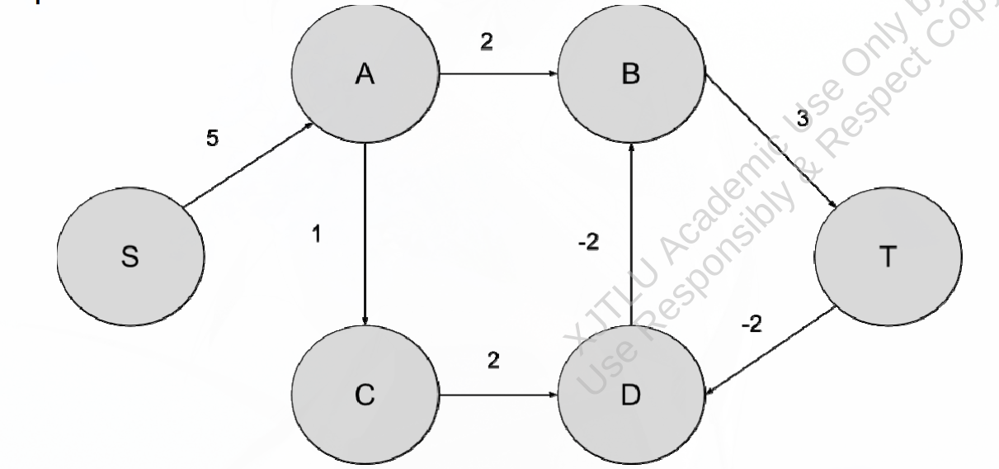

* Question 1 
** A):
Consider the following code fragment:
#+BEGIN_src lua
local function mystery(n)
	local r = 0
	for i = 1, n - 1 do
		for j = i + 1, n do
			for k = 1, j do
				print("foobar")
			end
		end
	end
	return r
end
#+END_src
Let T(n) denote the number of times 'foobar' is printed as a function of n
*** 1): Express T(n) as a summation (actually two nested summations).
T(n) = sum(i=1 to n-1) sum(j=i+1 to n) j 
*** 2): Simplify the summation, and give the worst-case running time using Big-O notation
T(n) = sum(i=1 to n-1) [( i+1 ) + (i + 2) + ... + n]
T(n) = sum(i=1 to n-1) [(n - 1 - i) * (n + i + 1) / 2]
T(n) = sum(i=1 to n-1) [(n^2 - 1 - i^2) / 2]
(n - 1 - i) * (n + i + 1) = n^2 - i - i^2  - 1 - i

** B): 
We have the folllowing piece of code ,representing a recursive function:
#+BEGIN_src lua
function Noidea(n)
    if n > 1 then
        print 'A'
        NoIdea(n/3)
            for i = 1 to n do
            print 'B'
            end
        NoIdea(n/3)
    end
end
#+END_BEGIN_src
*** What is the  runtime of the above function? Express you answer using Big-O notation
T(n) = 2T(n/3) + Θ(n)
using Master Theorem: a = 2, b = 3, f(n) = O(n)

n^log_b(a) = n^log_3(2) ~= n^0.63
since f(n) = Θ(n) is polynomiallly largeer than n^log_b(a) = n^0.63,
this is Case 3 of the Master Theorem
Therefore, T(n) = θ(n)
so the runtime is O(n)

*** Express the number of timies that this algorithmm prints 'A' in terms of n using big-O notation
let A(n) be the number of times 'A' is printed
A(n) = 2A(n/3) + 1
using the Master Theorem: a = 2, b = 3, f(n) = θ(1)
n^log_b(a) = n^log_3(2) ~= n^0.63
since f(n) = Θ(1) is polynomially smaller then n^log_b(a) = n^0.63,
therfore, 
A(n) = Θ(n^log_b(a)) 
so the numbers of times 'A' is printed is O(n^(log_3(2)))

* Qeustion 2:
 Delete two minimum numbers on the following min-heap, You do not need to show the array representation of the heap. You are only required to draw the intermediate heaps and circle the final step.

* Question 3:
Let set S = {a, b, c, d, e} denote a set of objects with weights and benefits as given in hte table below
| item    | a  | b | c | d  | e |
| ------- | -- | - | - | -- | - |
| Benefit | 13 | 9 | 8 | 15 | 6 |
| Weight  | 5  | 5 | 5 | 3  | 1 |

whatis an optimal solution to the fractional knapsack problem for S assuming that we have a sack that can hold objects with total weight 18
*** sol:
we can calculate the benefit per item first
| Item | Benefit | Weight | Benefit/Weight |
| ---- | ------- | ------ | -------------- |
| a    | 13      | 5      | 2.6            |
| b    | 9       | 5      | 1.8            |
| c    | 8       | 5      | 1.6            |
| d    | 15      | 3      | 5              |
| e    | 6       | 1      | 6              |
we can pack item according to the benenfit/weigt ratio. 
we pack e first, weight = 1, benefit = 6, weight left = 17
pack d secondly, weigt = 3, benefit = 15, weight left = 14
pack a thirdly, weight = 5, benefit = 13, weight left = 9
pack b fourthly, weight = 5, benefit = 9, weight left = 4
pack c last, we can only pack 4/5 of c, weight = 4, benefit = 8 * 4/5 = 6.4
the total benefit is 6 + 15 + 13 + 9 + 6.4 = 49.4
*  Question 4:
** A) 
Prove that logn + loglogn is Θ(logn)
*** sol:
to prove that logn + loglogn is Θ(logn), we need to prove that the big-O and big Omega bounds are both satisfied;
1. Prove that logn + loglogn is O(logn)
   prof:
   given a constant c > 0 and n0 > 0, we need to show that logn + loglogn <= c * logn for all n >= n0
   logn + loglogn <= (c-1) * logn + logn 
   n >= n0
   loglogn <= (c-1) * logn
   when c = 2, loglogn <= logn for all n >= 2
   therefore, logg + logn is O(logn)
2. prove that logn + loglogn is Ω(logn)
   geiven a constant c > 0 and n0 > 0, we need to show that logn + loglogn >= c * logn for all n >= n0
   logn + loglogn >= c * logn
   when c = 1, n0 = 1 logn + loglogn >= logn for all n >= 1
   therefore, logn + loglogn is Ω(logn)
3. since logn + loglogn is both O(logn) and Ω(logn), we can conclude that logn + loglogn is Θ(logn)

** B): 
Give a tight upper bound (Big-O notation) on the solution to the following function. You need to justify your answer
T(n) = {1 if n = 1, T(n-1) + n(n-2) if n>=2}
*** sol:
T(n) = T(n-1) + n(n-2)
T(n-1) = T(n-2) + (n-1)(n-3)
T(n) = T(n-2) + (n-1)(n-3) + n(n-2) = T(1) + sum(k=2 to n) k(k-2)
T(n) = 1 + sum(k=2 to n) k(k-2) = 1 + sum(k=2 to n) (k^2 - 2k) 
= 1 + sum(k=2 to n) k^2 - 2 * sum(k=2 to n) k
= 1 + [n(n+1)(2n+1)/6 - 1] - 2 * [n(n+1)/2 - 1]
= n(n+1)(2n+1)/6 + 2 - n(n+1)
= ....
what ever, we can see that the dominant term is n^3, so T(n) is O(n^3)

* Question 5:

For a given weighted directed graph and two nodes s and t, the shortest path problem is to find a simple path (without repeating nodes) from S to T such that the sum of weighted edges in the path is smallest

** 1:  Given a step by step process of Dijkstra's algorithm for finding a shortest simple path from S to T in the given graph
| epoch | S | A    | B                                   | C    | D    | T     |
| ----- | - | ---- | ----------------------------------- | ---- | ---- | ----- |
| 0     | 0 | inf  | inf                                 | inf  | inf  | inf   |
| 1     | 0 | 5(S) | inf                                 | inf  | inf  | inf   |
| 2     | 0 | 5(S) | 7(A)                                | 6(A) | inf  | inf   |
| 3     | 0 | 5(S) | 7(A)                                | 6(A) | 8(C) | inf   |
| 4     | 0 | 5(S) | 7(A) 6(C)(but dij does not support) | 6(A) | 8(C) | inf   |
| 5     | 0 | 5(S) | 7(A) 6(C)(but dij does not support) | 6(A) | 8(C) | 10(B) |

** What is the shortest simple path from S to T and its total weight?
fuckyou, dji is no t support negative weight, so we can not find the shortest simple path from S to T using dijkstra's algorithm. 

* Question 6:
Alice and Bob wish to use RSA creyptosystem for communication. Alice announced the public modulus and encryption key pair to be (2501, 343)
** 1): Show 24^2401 mod 2501 = 24 using Euler's theorem
Euler theorem: if gcd(a, n) = 1, then a^phi(n) ≡ 1 mod n
Because 24^2401 mod 2501 = 24 => gcd(24, 2501) = 1, we can apply Euler's theorem to calculate 24^2401 mod 2501
phi(2501) = phi(41 * 61) = (41 - 1)(61 - 1) = 40 * 60 = 2400
therefore, 24^2401 mod 2501 = 24^(2400 + 1) mod 2501 = 24^2400 * 24^1 mod 2501 = 1 * 24 mod 2501 = 24

** 2): Derive the private key
phi(2501) = 2400
the e and d fullfill that e * d === 1 mod phi(n)
therefore 343d === 1 mod 2400 , d = 7
** 3): Assume Bob sent an encrypted message 4, What's the original unencrypted message?
M = C^d = 4 ^ 7 mod 2501 = 1378
