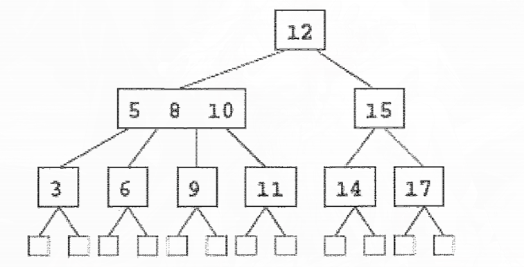
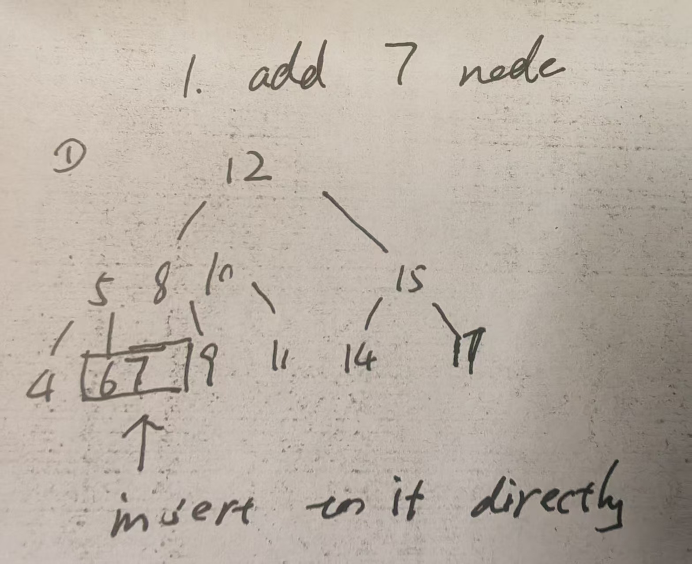
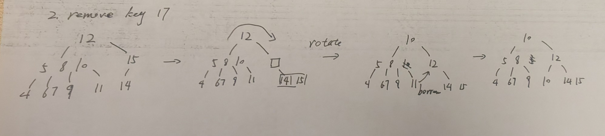
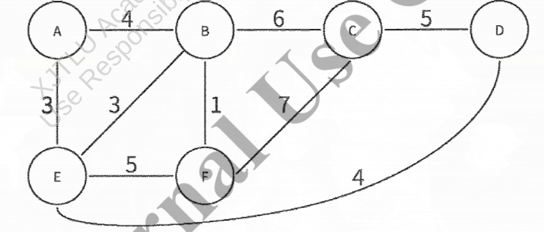

* Question 1 [25 Marks]
** A) 
Compute the following expression that are given in postfix notation, Show the procedure
1 2 + 4 * 3 +
*** sol: 1. encounter operand 1, 2 first, push 1, 2 into stack, the stack now is >[2, 1]
2. encounter operator +, then pop 2 and 1, compute 2 + 1 = 3, push 3 into stack, the stack now is >[3]
3. encounter operand 4, push 4 into stack, the stack now is >[4, 3]
4. encounter operator *, then pop 4 and 3, compute 3 * 4 = 12, push 12 into stack, the stack now is >[12]
5. encounter operand 3, push 3 into stack the stack now is >[3, 12]
6. encounter operator +, then popo 3 and 12, compute 12 + 3 = 15, push 15 into stack
7. reach the end of the expression, the stack now is >[15], which is the final result
*** note:
1. when entering the numer, then push it into the stack
2. when entering the operator, then pop the last two number from the stack
   the first poped element is the *right* operand and the second poped element is the *left* operand
3. the push the result into the stack
4. when all the elements in the stack are processed, then the stack should have only one element, which is the result
**** example:
1. 3 4 +: push 3, 4, stack: head [4, 3], then pop 4 and 3, compite 4 + 3 = 7, push 7, ended ,7 is the final result
2. 2 3 4 * + 5 /:
   push 2, 3, 4, stack: head head[4, 3, 2], then pop 4 and 3, compute 4 * 3 = 12, push 12, stack: head [12, 2], enconter operator +, then pop 12 and 2, compute 12 + 2 = 14, push 14, stack: head [14], encounter operand 5, push 5, 
   stack head: [5, 14], encounter operator /, then pop 5 and 14, compute 14 / 5 = 2.8; push 2.8

** B)
What is the asymprotoic value (both upper and lower bound, i.e. in Big-Theta notation) of the expression 
sum_{i=1}^{n} i^2
*** note:
- the upper bound (Big O nottaion) means the wrost case time complexity increasing rate of the expression.
  for an expression f(n), if there exist a constant c and n0 such that for all n > n0, f(n) <= c * g(n), then we say f(n) is O(g(n))
- the lower bound (Big Omega notation) means the best case time complexity increasing rate of the expression.
  for an expression f(n), if there eixts a constatn c and n0 such that for all n > n0, f(n) >= c * g(n), then we say f(n) is Omega(g(n))
- the Big Theta nottaion means the tight bound of the time complexity increasing rate of the expression.
  for an expression f(n), if there exist constants c1, c2 and n0 such that for all n > n0, c1 * g(n) <= fn(n) <= c2 * g(n), then we say f(n) is Theta(g(n))
*** sol:
1. Closure form of expression sum_{i=1}^{n} i^2 is 
   (累加公式：待整理)
   1 + 4 + 9 + ... + n^2 = (2n^3 + 3n^2 + n) / 6
2. Big-O
   for all n >= 1:
   (2n^3 + 3n^2 + n) / 6 <= (2n^3 + 3n^3 + n^3) / 6
   when c = 1, n0 = 1, S(n) < c * n^3, 
   therefore S(n) is O(n^3)
3. Big-Omega:
   for all n >= 1:
   (2n^3 + 3n^2 + n) / 6 >= (2n^3) / 6
   when c = 1/3, n0 = 1, S(n) >= c * n^3, 
   therefore S(n) is Omega(n^3)
4. Big-Theta:
   because S(n) is O(n^3) and S(n) is Omega(n^3), therefore S(n) is Theta(n^3)

** Consider the pseduo-codes representing two computer functions called loopA and loopB as follows:
#+BEGIN_lua lua
function loopA(n)
    for i = n, 2, -1 do
        for j = 1, i-1 do
            if T[j] > T[j+1] then
                swap(T[j], T[j+1])
            end
        end
    end
end
#+END_lua

#+BEGIN_lua lua
function loopB(n) 
    for s = 1, n do
        for t = 1, s do
            for k = 1, t do
                a = t + k
            end
        end
    end
end
#+END_BEGIN_lua

*** 1): how many times will the swap function be performed in the best case and worst case of loopA? justify you answer;
this Swap is bubble sort, 
- in the best case, the input array is already sorted, for comparison T[j] <= T[j+1] is false for all j, therefore tthe swap function will never be performed.
- in the worst case, in input array is sorted in reverse order, for comparison T[j] > T[j + 1] is true for all j, there fore the swap function will be performed for all j, which means the swap function will be performed;
  T(n) = (n - 1) + (n - 2) + ... + 1 = Sum(i=2 to n) = n(n-1)/2
  the worst case: (n-1)n/2 = O(n^2)

*** 2): Express the time complexity of the loopB function using Big-O notation . Justify you answer;
T(n) = sum(s=1 to n) sun(t=1 to s) sim(k=1 to t)
1. T(n) = sum(s=1 to n) sun(t=1 to s) t 
2. using formula sun(t=1 to s)t = s(s+1)/2
   sum(t=1 to s)t = 1 + ... + s = s(s+1)/2
   T(n) = sum(s=1 to n) s(s+1)/2
3. expand: T(n) = 1/2 sum(s=1 to n) (s^2 + s)
4. — 拆分求和：
     = 1/2 [ ∑(s=1 to n) s² + ∑(s=1 to n) s ]
5. use summation formula
   = 1/2 [ n(n+1)(2n+1)/6 + n(n+1)/2 ]
6. — 提取最高次项 n³：
     = 1/2 [ (2n³ + 3n² + n)/6 + (n² + n)/2 ]
     = n³/6 + n²/2 + n/3
therefore, thereexist a constant c that for all n > n0, T(n) <= c * n^3, therefore T(n) is O(n^3)

*** 3): Which program is faster? Justify your answer;
- loopA: O(n^2), loopB: O(n^3)
渐进分析： lim(n->inf) T_loopA(n) / T_loopB(n) = lim(n->inf) O(n^2)/O(n^3) = lim(n->inf)O(1/n) = 0
that is, when n is large enough, loopA's runningtime is relative 0 than loopB, nomater what hte constant is.
n^3's increaing rate is way faster then n^2

* Question 2 [13 Marks]
The worst-case running time T(N) of merges sort on an input sequence of size N can be characterized by the following recurrent equation:
T(N) = {
a (if N = 1),
2(T(N/2)) + bN if N > 1
}
wherein a > 0 and b > 0 are constants.
** 1): Explain why the above recurrence equation can characterize the wrost-case running time of Merge Sort:
the merge sort can be divide into three parts:
1. divide: divide the input array into two halves, which takes O(1) time
2. conquer: recursively sort the two halves, which takes 2T(N/2)
3. Merge: merge two sorted haves into one sorted array, which takss O(N)
epanantion for recurrent equation：
1. Base case: N=1: hwen the input array has only one element, it is already sorted, therefore the running time is a constant
2. Recursive case (N>1): 
    - 2T(N/2): for the subquestion of size N/2, they need T(N/2) times independently,
    - bN: merge the two length N/2 sorted subarrays into one length N sorted array, which takes O(N).
    N's element requires N times comparison and write

** 2): Solve the above recurrence equation and express the time complexity of Merge-Sort using Big-O notation, jusify your anser;
T(1) = a
T(N) = 2T(N/2) + bN
*** method 1: expand the recurrent equation:
0. N -> bN
1. N/2 N/2 -> 2*b(N/2) = bN
2. N/4 N/4 N/4 N/4 -> 4*b(N/4) = bN
k. sum(i=1 to 2^k) N/2^k -> 2^k * b(N/2^k) = bN
when N/2^k = 1, N = 2^k, k = log_2(N)
total log_2(N) + layers, each layer takes bN time, 
total time: T(N) = bN * log_2(N) + bN  = bN(log_2(N) + 1) = O(N log N)
therefore, the time complexity of Merge Sort is O(N log N)
*** method 2: using Master Theorem:
Master Theorem: 
T(N) = aT(N/b) + f(n)
- a is the subproblem count, 
- f(n) is the time to divide and merge.
- b is the factor by which the subproblem size is reduced.
in this case, a = 2, b = 2, f(n) = bN = 0(N)
T(N) = 2T(N/2) + bN
- compute the critical exponent:
  c_crit = log_b(a) = log_2(2) = 1
  compare the f(N) and N^(c_crit) = N^1: 
  f(N) = 0(N) = 0(N^1)
match the master theorem case:
  - case 1: given f(n) = O(n^(c_crit - ε)) , T(n) = Θ(n^(c_crit))
  - case 2: given f(n) = Θ(n^(c_crit) · logᵏ n), T(n) = Θ(n^(c_crit) · logᵏ⁺¹ n)
  - case 3: given f(n) = Ω(n^(c_crit + ε)), T(n) = Θ(f(n))
because f(N) = O(N^1) = O(N^(c_crit) * log^0(N))
Therefore T(N) = Θ(N^(c_crit) * log^(k+1) N) = Θ(N log^1(N))
T(N) = Theta(N log N)
*** method 3: 代入法
T(N) = 2T(N/2) + bN
= 2[2T(N/4) + b(N/2)] + bN = 4T(n/4) + 2bN
= 4[2T(N/8) + b(N/8)] + 2bN = 8T(N/8) + 3bN
= 2^k T(N/2^k) + kbN
when 2^k = N then k = log_2(N)
= N T(1) + bN log_2(N) = aN + bNlog_2(N) 
T(N) is O(N log(N))

* Qeustion 3 [12 Marks]
Let T be a (2, 4) tree shown below, which stores items with integer keys, Draw all the steps and the resulting trees obtained by performing the following operations on the original (given) T

a. Insert an itesm with key 7 into T
   
b. Remove an item with the key 17 from T
   

* Quesstion 4 [15 Marks]
given the following weighted undirected graph:

** 1): Show the step by step process of using the Kruskal's algorightm toe find the minimum spanning tree, We start with node A, and draw the mininum spanning tree;
Step 1. 按权值升序排列所有边：
         BF(1), AE(3), BE(3), AB(4), DE(4), CD(5), EF(5), BC(6), CF(7)
Step 2. 初始化：每个顶点自成一个分量
         {A}, {B}, {C}, {D}, {E}, {F}
         MST = ∅
         MST 权值 = 0
Step 3. 按序处理每条边：
  (a) 边 BF(1)：B 与 F 不在同一分量，加入 MST
      MST = {BF}，权值 = 1
      合并分量：{A}, {B, F}, {C}, {D}, {E}
  (b) 边 AE(3)：A 与 E 不在同一分量，加入 MST
      MST = {BF, AE}，权值 = 1 + 3 = 4
      合并分量：{A, E}, {B, F}, {C}, {D}
  (c) 边 BE(3)：B 与 E 不在同一分量，加入 MST
      MST = {BF, AE, BE}，权值 = 4 + 3 = 7
      合并分量：{A, B, E, F}, {C}, {D}
  (d) 边 AB(4)：A 与 B 已在同一分量（均在 {A, B, E, F} 中），
      形成环路 → 丢弃
  (e) 边 DE(4)：D 与 E 不在同一分量，加入 MST
      MST = {BF, AE, BE, DE}，权值 = 7 + 4 = 11
      合并分量：{A, B, D, E, F}, {C}
  (f) 边 CD(5)：C 与 D 不在同一分量，加入 MST
      MST = {BF, AE, BE, DE, CD}，权值 = 11 + 5 = 16
      合并分量：{A, B, C, D, E, F}
  (g) 终止条件：|MST| = |V| − 1 = 5 条边，算法结束
      （后续边 EF, BC, CF 均无需检查）
Step 4. 最小生成树：
         MST = {BF, AE, BE, DE, CD}
         总权值 = 1 + 3 + 3 + 4 + 5 = 16

** 2): What is the total wieght of the minimum spanning tree? 
we can add up the weight of all the edges in the minimum spanning tree, 
which is BF + AE + BE + DE + CD = 1 + 3 + 3 + 4 + 5 = 16

* Question 5 [15 Marks]
Alice and Bob wish to use RSA cryptosystem for ocmmunication, Bob announced the public modulus and encyption key pair to be (91, 29).
If a third-party intercept on the message, He got the encrypted message and the public modulus and encryption key pair to be (91, 29), Try to help him restore it to the original message.
** (1) Compute phi(n) and the prime number p and q associated with public modulus n;
given n = 91, e = 29
- decomposite n into two different prime factors 
    91 = 7 * 13
    therfore, p = 7, q = 13
- calcualte the euler totient function phi(n) = (p-1)(q-1) = (7-1)(13-1) = 72

** (2) Derive the private key.
the private key fullfill that 
e * d mod phi(n) = 1
29d === 1 mod 72
that is, solve the equation
29d - 72k = 1

r1 = a; r2 = b;
s1 = 1; s2 = 0;
t1 = 0; t2 = 1;
while r2 > 0:
    q = r1 // r2
    # updateing r's
    r = r1 - q * r2
    r1 = r2; r2 = r
    # updating s's
    s = s1 - q * s2
    s1 = s2; s2 = s
    # updating t's
    t = t1 - q * t2
    t1 = t2; t2 = t;
gcd(a, b) = r1; s = s1; t = t1

| r  | r1 | r2 | q  | s   | s1 | s2  | t  | t1 | t2 |
| -- | -- | -- | -- | --- | -- | --- | -- | -- | -- |
|    | 29 | 72 |    |     | 1  | 0   |    | 0  | 1  |
| 29 | 72 | 29 | 0  | 1   | 0  | 1   | 0  | 1  | 0  |
| 14 | 29 | 14 | 2  | -2  | 1  | -2  | 1  | 0  | 1  |
| 1  | 14 | 1  | 2  | 5   | -2 | 5   | -2 | 1  | -2 |
| 0  | 1  | 0  | 14 | -72 | 5  | -72 | 29 | -2 | 29 |

轮次	q	r₁	r₂	r	s₁	s₂	s	t₁	t₂	t
初始	—	29	72	—	1	0	—	0	1	—
1	0	72	29	29	0	1	1	1	0	0
2	2	29	14	14	1	−2	−2	0	1	1
3	2	14	1	1	−2	5	5	1	−2	−2
4	14	1	0	0	5	−72	−72	−2	29	29

finally, gcd(29, 72) = gcd(72, 29) = gcd(29, 14) = gcd(14, 1) = gcd(1, 0) = 1
therefore thereexist an 乘法逆元 (multiplicative inverse) of 29 mod 72
s = s1 = 5, t = t1 = -2
so the d = 5

** (3) What's the original unencrypted message, if encrypted message as 10?
m === c^d === 10^5 mod 91
10^5 = 10^4 * 10 = (10^2)^2 * 10
step1: 10^2 === 100 mod 91 = 9
step2: 10^4 === 9^2 mod 91 = 81
step3: 10^5 === 81 * 10 mod 91 = 810
step4: 10^5 === 810 mod 91 = 81
or
10⁵ ≡ (10²)² × 10
      ≡ 9² × 10
      ≡ 81 × 10
      ≡ (−10) × 10       (∵ 81 ≡ −10 mod 91)
      ≡ −100
      ≡ −9               (∵ −100 + 91 = −9)
      ≡ 82 (mod 91)

* Question 6 [15 Marks]
A Vertex Cover set S of an undirected graph G = (V, E) is a subset of V such that every edge in E has at least one endpoint in S, if the size of S is no more than t. An Independent Set S of graph G = (V, E) is a ste of vertives such that no two vertices in S are adjacent to each other. It consissts of non-adjacent vertives. The Independent Set is to determine if the graoph contasins an independedt set of verticess of at least size k;
1) Is the vertex cover problem in NP? prove or disprove it;
2) Provide a reduction from Indepdent Set to Vertex Cover probelm. and prove it;
** Note:
- what is Vertex Cover:
  in a graph: at least one endpoint of every edge is in the vertex cover set S
- Independent Set:
  in the Point Set S , there is no edge between any two vertics.
- Core Threom: 
  if S is Independent Set, the V \ S is Vertex Cover Set
** 问题定义
给定一个无向图（undirected graph）G = (V, E)。
- V 表示顶点集合（vertex set）。
- E 表示边集合（edge set）。
- 一条边可以写成 (u, v)，表示顶点 u 和顶点 v 相连。

*** Vertex Cover 定义
点覆盖（Vertex Cover）是一个顶点子集（subset）C ⊆ V，满足：
- 对于每一条边 (u, v) ∈ E，至少有一个端点（endpoint）在 C 中。
- 也就是说，对每条边 (u, v)，必须满足 u ∈ C 或 v ∈ C。
点覆盖判定问题（decision problem）是：
- 输入：图 G = (V, E)，整数 t
- 问题：是否存在一个点覆盖 C ⊆ V，使得 |C| ≤ t？
*** Independent Set 定义
独立集（Independent Set）是一个顶点子集 I ⊆ V，满足：
- I 中任意两个顶点之间都没有边。
- 也就是说，不存在 u, v ∈ I，使得 (u, v) ∈ E。
独立集判定问题（decision problem）是：
- 输入：图 G = (V, E)，整数 k
- 问题：是否存在一个独立集 I ⊆ V，使得 |I| ≥ k？

** 1) Vertex Cover is in NP
我们证明点覆盖问题（Vertex Cover）属于 NP。
NP 的证明思路是：
- 对于一个 yes-instance，如果别人给出一个证书（certificate），我们可以在多项式时间（polynomial time）内验证它是否正确。
对于 Vertex Cover，证书（certificate）就是：
- 一个候选点集合 C ⊆ V
也就是说，别人声称：

- C 是一个点覆盖（vertex cover）
- 并且 |C| ≤ t
我们只需要验证这个说法是否正确。
*** Verifier
验证算法（verifier）如下：
#+BEGIN_SRC text
Verifier(G = (V, E), t, C):
1. If |C| > t:
   reject
2. For each edge (u, v) in E:
   if u ∉ C and v ∉ C:
   reject
3. accept
   #+END_SRC
*** Correctness
正确性（correctness）证明：
- 如果 verifier 接受（accept），说明：
  * |C| ≤ t
  * 对每一条边 (u, v) ∈ E，都有 u ∈ C 或 v ∈ C
- 因此，C 覆盖了所有边。
- 所以 C 是一个大小不超过 t 的点覆盖（vertex cover）。
反过来：
* 如果 (G, t) 是 Vertex Cover 的 yes-instance，
* 那么存在某个点覆盖 C，使得 |C| ≤ t。
* 把这个 C 作为证书（certificate）交给 verifier，
* verifier 检查所有边时都不会失败，
* 所以 verifier 会接受。

因此，verifier 的判断是正确的。

*** Running time

时间复杂度（running time）分析：

设：

* n = |V|
* m = |E|

verifier 需要做两件事：

* 检查 |C| ≤ t
* 遍历每条边 (u, v) ∈ E，检查 u ∈ C 或 v ∈ C

如果用哈希表（hash set）或布尔数组（boolean array）存储 C，那么检查 u ∈ C 可以在 O(1) 时间完成。

因此，总时间复杂度是：

#+BEGIN_SRC text
O(|V| + |E|)
#+END_SRC

这是多项式时间（polynomial time）。

所以结论是：

#+BEGIN_SRC text
Vertex Cover ∈ NP
#+END_SRC

** 2) Reduction from Independent Set to Vertex Cover

我们证明：

#+BEGIN_SRC text
Independent Set ≤p Vertex Cover
#+END_SRC

意思是：

* 独立集问题（Independent Set）可以在多项式时间内归约（polynomial-time reduction）到点覆盖问题（Vertex Cover）。
* 也就是说，如果我们能解决 Vertex Cover，那么我们也能解决 Independent Set。

*** Reduction construction

给定一个 Independent Set 的实例（instance）：

#+BEGIN_SRC text
(G, k)
#+END_SRC

其中：

* G = (V, E)
* k 是要求的独立集大小
* n = |V|

我们构造一个 Vertex Cover 的实例：

#+BEGIN_SRC text
(G', t)
#+END_SRC

构造方式如下：

#+BEGIN_SRC text
G' = G
t = n - k
#+END_SRC

也就是说：

* 图不变
* 只把参数从 k 改成 n - k

所以归约函数（reduction function）是：

#+BEGIN_SRC text
f(G, k) = (G, |V| - k)
#+END_SRC

我们需要证明：

#+BEGIN_SRC text
G has an independent set of size at least k
⇔
G has a vertex cover of size at most |V| - k
#+END_SRC

中文意思是：

#+BEGIN_SRC text
G 中存在大小至少为 k 的独立集
当且仅当
G 中存在大小至多为 |V| - k 的点覆盖
#+END_SRC

** 正确性证明

我们证明两个方向。

*** Direction 1: Independent Set ⇒ Vertex Cover

假设：

#+BEGIN_SRC text
G 有一个独立集 I，并且 |I| ≥ k
#+END_SRC

我们构造：

#+BEGIN_SRC text
C = V \ I
#+END_SRC

也就是：
- C 是所有不在 I 里面的顶点。
- C 是 I 的补集（complement）。
我们要证明：
#+BEGIN_SRC text
C 是一个点覆盖，并且 |C| ≤ n - k
#+END_SRC
**** Size condition
首先证明大小条件（size condition）：
因为：
#+BEGIN_SRC text
|I| ≥ k
#+END_SRC
所以：
#+BEGIN_SRC text
|C| = |V \ I| = n - |I|
#+END_SRC
又因为 |I| ≥ k，所以：
#+BEGIN_SRC text
n - |I| ≤ n - k
#+END_SRC
因此：
#+BEGIN_SRC text
|C| ≤ n - k
#+END_SRC
也就是：
#+BEGIN_SRC text
|C| ≤ t
#+END_SRC
大小条件满足。
**** Cover condition
然后证明覆盖条件（cover condition）：
任取一条边：
#+BEGIN_SRC text
(u, v) ∈ E
#+END_SRC
因为 I 是独立集（independent set），所以 I 里面任意两个点之间都没有边。
因此，u 和 v 不可能同时在 I 中。
也就是说：
#+BEGIN_SRC text
u ∉ I 或 v ∉ I
#+END_SRC
所以：
#+BEGIN_SRC text
u ∈ V \ I 或 v ∈ V \ I
#+END_SRC
又因为：
#+BEGIN_SRC text
C = V \ I
#+END_SRC
所以：
#+BEGIN_SRC text
u ∈ C 或 v ∈ C
#+END_SRC
因此，每一条边 (u, v) 都至少有一个端点在 C 中。
所以 C 是一个点覆盖（vertex cover）。
因此：
#+BEGIN_SRC text
如果 G 有大小至少为 k 的独立集，
那么 G 有大小至多为 n - k 的点覆盖。
#+END_SRC
*** Direction 2: Vertex Cover ⇒ Independent Set
假设：
#+BEGIN_SRC text
G 有一个点覆盖 C，并且 |C| ≤ n - k
#+END_SRC
我们构造：
#+BEGIN_SRC text
I = V \ C
#+END_SRC
也就是：
- I 是所有不在 C 里面的顶点。
- I 是 C 的补集（complement）。
我们要证明：
#+BEGIN_SRC text
I 是一个独立集，并且 |I| ≥ k
#+END_SRC
**** Size condition
首先证明大小条件（size condition）：
因为：
#+BEGIN_SRC text
|C| ≤ n - k
#+END_SRC
所以：
#+BEGIN_SRC text
|I| = |V \ C| = n - |C|
#+END_SRC
又因为 |C| ≤ n - k，所以：
#+BEGIN_SRC text
n - |C| ≥ n - (n - k)
#+END_SRC
因此：
#+BEGIN_SRC text
|I| ≥ k
#+END_SRC
大小条件满足。
**** Independent condition
然后证明独立性条件（independent condition）：
我们用反证法（proof by contradiction）。
假设 I 不是独立集。
那么存在两个顶点 u, v ∈ I，使得：
#+BEGIN_SRC text
(u, v) ∈ E
#+END_SRC
因为：
#+BEGIN_SRC text
I = V \ C
#+END_SRC
且：
#+BEGIN_SRC text
u ∈ I, v ∈ I
#+END_SRC
所以：
#+BEGIN_SRC text
u ∉ C 且 v ∉ C
#+END_SRC
但是 (u, v) 是图中的一条边。
如果 u 和 v 都不在 C 中，那么这条边 (u, v) 没有任何端点在 C 中。
这说明 C 没有覆盖边 (u, v)。
这与 C 是点覆盖（vertex cover）的假设矛盾。
因此，I 中不可能存在相邻的两个顶点。
所以：
#+BEGIN_SRC text
I 是一个独立集
#+END_SRC
因此：
#+BEGIN_SRC text
如果 G 有大小至多为 n - k 的点覆盖，
那么 G 有大小至少为 k 的独立集。
#+END_SRC
** Reduction correctness
根据上面两个方向，我们已经证明：
#+BEGIN_SRC text
G has an independent set of size at least k ⇔ G has a vertex cover of size at most |V| - k
#+END_SRC
也就是：
#+BEGIN_SRC text
(G, k) ∈ Independent Set ⇔ (G, |V| - k) ∈ Vertex Cover
#+END_SRC
所以这个归约是正确的。

** Reduction running time
这个归约只做了两件事：

- 保留同一张图 G
- 计算 t = |V| - k
如果需要显式复制整张图，时间复杂度是：
#+BEGIN_SRC text
O(|V| + |E|)
#+END_SRC
这是多项式时间（polynomial time）。 因此：
#+BEGIN_SRC text
Independent Set ≤p Vertex Cover
#+END_SRC
** Core theorem
核心定理（core theorem）：
对于任意无向图 G = (V, E) 和任意顶点子集 S ⊆ V：
#+BEGIN_SRC text
S 是独立集 ⇔ V \ S 是点覆盖
#+END_SRC
原因：
- 如果 S 是独立集，那么 S 内部没有边。
- 因此，每条边都不可能两个端点都在 S 中。
- 所以每条边至少有一个端点在 V \ S 中。
- 因此，V \ S 是点覆盖。
反过来：
 - 如果 V \ S 是点覆盖，那么每条边至少有一个端点在 V \ S 中。
 - 因此，不可能存在一条边的两个端点都在 S 中。
 - 所以 S 内部没有边。
 因此，S 是独立集。
** Exam conclusion
最终结论：
#+BEGIN_SRC text
1. Vertex Cover ∈ NP.
2. Independent Set can be reduced to Vertex Cover by mapping: (G, k) ↦ (G, |V| - k).
3. The reduction is correct because:
   G has an independent set of size at least k ⇔ G has a vertex cover of size at most |V| - k.
4. The reduction runs in polynomial time.
Therefore:
Independent Set ≤p Vertex Cover.
#+END_SRC
