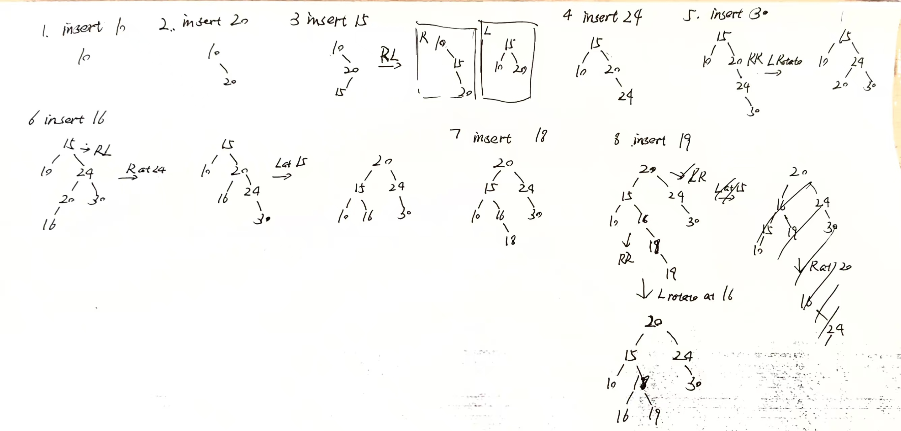
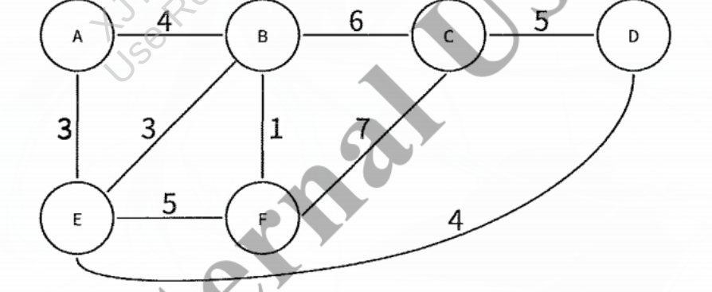
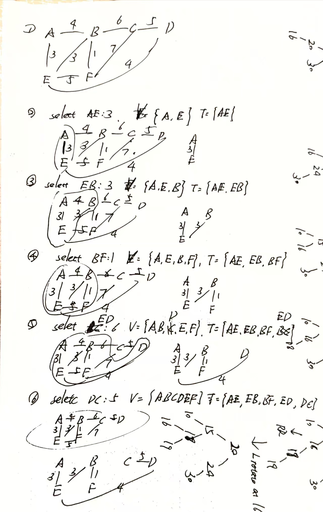

* Question 1.
** A) Compute the following expressions that are given in postfix notation:
5 7 * 3 4 1 + * +
*** sol:
1. push 5, 7 into stack: stack = [5, 7]
2. encounter operator *, pop 7 first, then pop 5, compute 5 * 7 = 35, push result back to stack: stack [35]
3. push 3, 4, 1 into stack: stack = [35, 3, 4, 1]
4. encounter operator +, pop 1 first, then pop 4, compute 4 + 1 = 5, push result back to stack: stack = [35, 3, 5]
5. encounter operator *, pop 5 first, then pop 3, compute 3 * 5 = 15, push result back to stack: stack = [35, 15] 
6. encounter operator +, pop 15 first, then pop 35, compute 35 + 15 = 50, push result back to stack: stack = [50]
7. final result is 50

** B): What is the asymptotic upper value of the expression sum(i=1 to n)i^2 as a functiom of n?
*** sol:
we can use
*** method 1: summation formula:
1 + 2^2 + 3^2 + ... + n^2 = n(n + 1)(2n + 1) / 6 = n^2 + n (2n + 1) / 6 = (2n^3 + 3n^2 + n) / 6 
note:
we should find the n0 that make all the (2n^3 + 3n^2 + n) / 6 <= (2n^3 + 3n^3 + n^3) / 6 
n0 = 1, c = 1
formal expression: 
for all n >= 1, (2n^3 + 3n^2 + n) / 6 <= (2n^3 + 3n^3 + n^3) / 6
when c = 1, n0 = 1, S(n) < c * n^3, 
therefore S(n) is O(n^3)
** C) Given an upper tight bound of the runtime complexity class for each of the following two code fragments in Big-O notation, in terms of the variable N. Justify your answer;
*** a
#+BEGIN_1 c
int sum = 0;
for (int i = 1; i <= N-5; i++) {
    for (int j = 1; j <= N-5; j=j*2) {
        sum++;
    }
}
#+END_1
*** sol1:
the outer loop runs N-5 times,
fot inner loop runs log2(N-5) times.
T(N) = Sum(i=1 to N-5) log_2(N-5)
using the summation formula
S(n) = (n-5)log_2(n-5)−(n-5)+O(log_2(n-5))
therefore T(N) is O(N log N)
*** b
#+BEGIN_1 c
int sum = 0;
for (int i = 0; i < 1000; i++) {
    for (int j = 0; j <= i; j++) {
        sum += N; }
    for (int j = 1; j <= i; j++) {
        sum += N; }
    for (int j = 1; j <= i; j++) {
        sum += N;   }
}
#+END_BEGIN_1
这是蛆
*** sol2:
T(n) = 1000 * 3 * (1 + 2 + ... + 1000)
T(n) is O(1)

* Question 2:
Given two 64 bit integers a and n, here is an algorithm to compute a^n
#+BEGIN_1 text
Power(a,n):
1. if n = 0, return 1;
2. if n = 1, return a;
3. if n is even:
4. return Power(a*a, n/2);
5. else:
6. Return a * Power(a*a, (n-1)/2);
#+END_BEGIN_1
assume throughout this problem that we do not need to worry about overflow (a^n fits into a 64-bit integer variable) and that each operation on a 64-bit integer takes O(1) times
** 1) let A(n) donote the running time of Power(a, n). Write a recurrence relation for A(n)
** 2): What is the solution (in Big-Theta notation) to your recurrence A(n)? Justify your answer
*** sol:
**** how to trans into recurrence form:
    if n = 0 / 1, A(n) = θ(1)
    if n is even, a * a -> θ(1); Power(a*a, n / 2) -> A(n / 2);
    if n is odd, a * a -> Θ(1); Power(a*a, (n-1) / 2) -> A((n-1) / 2); 
    because n / 2 = floor(n / 2) = (n-1)/2
    so the final result:
    A(n) = {
        Θ(1) if n = 0 / 1
        θ(floor(n/2)) + Θ(1) if n >= 2
    }
    cause' floor does not afftect the asymptotic complexity, we can simplify the result to:
    A(n) = A(n/2) + Θ(1)
**** What is Master Theorem:
  Master Theorem is to solve the problem of form T(n) = aT(n/b) + f(n)
  a is the number of subproblems in the recursion, b is the factor by which the subproblem size is reduced, and f(n) is the extra work done at each level of the recursion.
**** the common cases for Master Theorem:
  T(n) = aT(n/b) + f(n)
  we calculate the n^(log_b(a)) first. 
  n^(log_b(a)) is the work done at recussive part
***** case 1: if f(n) is O(n^(log_b(a) - ε)), this means f(n) is smaller than the work done at recursive part by one polynomial factor
then the recursion part should dominate the total work.
for example: 
T(n) = 2T(n/2) + θ(1)
a = 2, b = 2, f(n) = Θ(1), n^(log_2(2)) = n^1 = n
since f(n) = Θ(1) 
therefore T(n) = θ(n)
***** case 2: if f(n) is same size with n^(log_b(a)), this means f(n) is same size with the work done at recursive part
then the total work should be the work done at recursive part times log n, because there are log n levels of recursion.
f(n) = θ(n^(log_b(a)))
then T(n) = θ(n^(log_b(a)) log n)
both side have the same size, so we multiply an extra log n to the result
***** case 3:
f(n) = Ω(n^(log_b(a)) + ε)
and also fullfill regularity condition: a f(n/b) <= c f(n) where c < 1
T(n) = Θ(f(n))
**** method 1: use Master Theorem:
A(n) can be simplified into A(n) = A(floor(n/2)) + θ(1)
can to use Master Theorem to solve the problem: 
A(n) = A(n/b) + θ(1)
a = 1, b = 2, f(n) = θ(1), n^(log_2(1)) = n^0 = 1
therefore, f(n) = θ(1) = n^(log_2(1)), Match the case 2 of Master Theorem;
T(n) =  θ(n^(log_2(1)) log n) = θ(log n)

* Question 3:
 Insert the following sequence of elements into an AVL tree, starting with an empty tree: 
 10, 20, 15, 24, 30, 16, 18, 19, Draw the AVL tree after each insertion 
*** sol:

* Question 4:
Given the following weighted undirected graph:

** (1) show the step by step process of using the prim's algorithm to find the minimum spanning tree. We start with node A. And draw the minimum spanning tree.

** (2): What is the total weight of the minimum spanning tree
the total weight is 3 + 3 + 1 + 4 + 5 = 16

* Question 5:
Alice and Bob are using the RSA cryptosystem for secure communication. Bob has chosentwo prime numners p = 5 and q = 17 to generate his public and private keys
** 1) Compute n, phi(n), and select a valid encryption key e (e is less than 10)
n = p * q = 5 * 17 = 85
phi(n) = (p - 1)(q - 1) = 64
the e should fullfill that
1. 1 < e < phi(n)
2. gcd(e, phi(n)) = 1
3. 1 < e < 10
therefore, 5 is possible to be the encryption key e
verify: gcd(5, 64) = 1

** 2) Encrypte the messge 4 acoording to the selectde encryption key e;
the encrypted message 
C = M^e mod n = 4^5 mod 85
4^5 === 4^4 * 4 === 256 * 16 mod 85 ===
( 256 mod 85 * 4 mod 85 ) mod 85
=== 1 * 4 mod 85 = 4

** 3) Derive the private key d.
the e and d should fullfill that e * d mod phi(n) = 1
therefore 5d mod 64 = 1
thatis, 5d - 64k = 1
using Euclidean Algorithm to solve this shit
| epoch   | q    | r    | r1 | r2 | s    | s1  | s2  | t    | t1 | t2 |
| ------- | ---- | ---- | -- | -- | ---- | --- | --- | ---- | -- | -- |
| initial | null | null | 5  | 64 | null | 1   | 0   | null | 0  | 1  |
| 1       | 0    | 5    | 64 | 5  | 1    | 0   | 1   | 0    | 1  | 0  |
| 2       | 12   | 4    | 5  | 4  | -12  | 1   | -12 | 1    | 0  | 1  |
| 3       | 1    | 1    | 4  | 1  | 13   | -12 | 13  | -1   | 1  | -1 |
| 4       | 4    | 0    | 1  | 0  | -64  | 13  | -64 | 5    | -1 | 5  |
d = s1 = 13, -k = t1 = -64, k = 64
therefore the private key d is 13
* Question 6:
 Let G = (V, E) be a direccted graph, Let S be a subset of edges G such that deletion of S (edges) results in a graph G' with no directed cycles. SSuch an S is a feedback arc set. The size of S is the number of edges in S. The Feedback Arc Set (FAS) decision problem is "to determine for a given integer k if G has a feedbacl arc set of size at most k".
** 1): Is the Feedback Arc Set (FAS) problem NP? Prove or disacprove it.
** 2): Provide a reduction from the Vertex Cover (VC) problem to the feedback Arc Set (FAS) problem, and prove its correctness.
